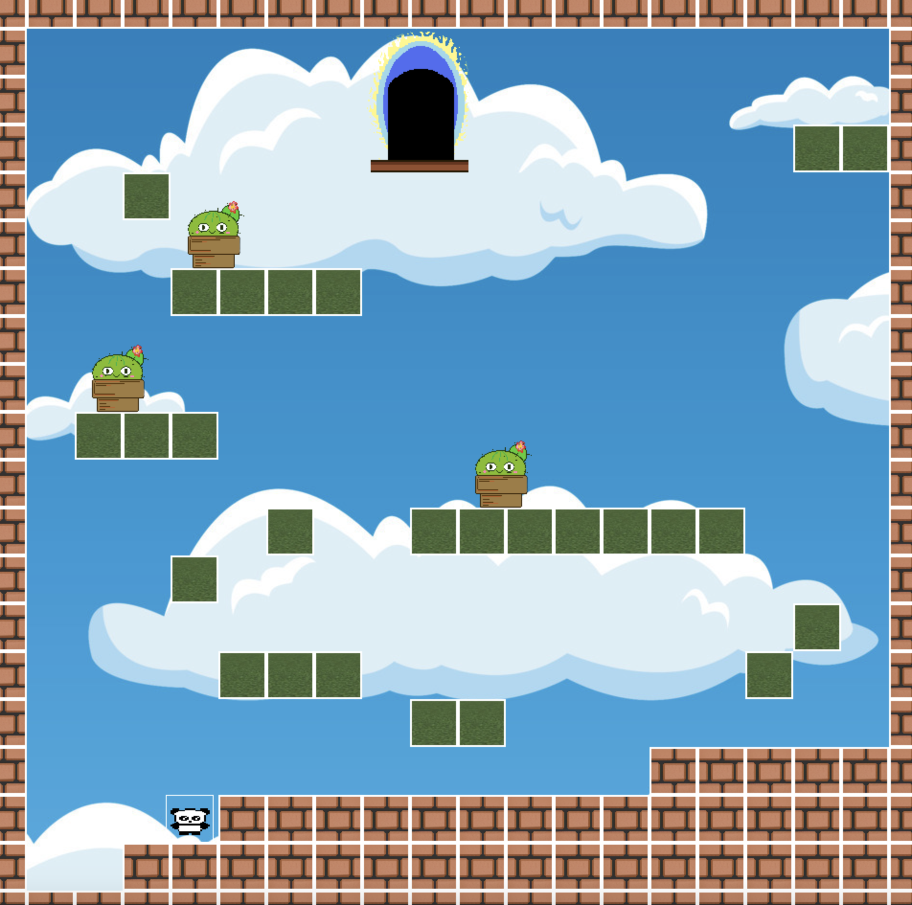

# Project-3-Mario
# Project-3-Mario
Mario Game by Pygame

Welcome to the our game project! This simple version Mario game of us is built using the Pygame library in Python. Have fun playing the character, avoiding obstacles, and navigating through different maps.

# Prerequisites
Make sure you have Python and Pygame installed on your system.

```pip install pygame```

# How to Play
Run the Mario.py script to start the game.

```Mario.py```

# Use the arrow keys to move Mario:

```Left arrow: Move left```

```Right arrow: Move right```

```Space Bar: Jump```

Navigate through the level, avoiding lava, spikes, and monsters.

If Mario touches lava, spikes, or a monster, the game will end, and a restart button will appear.

Enter the portal door to advance to the next map.

On the menu page, you can start the game or stop using the respective buttons.


# Screenshots
 
